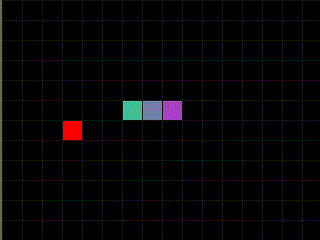

# Snake Game

Basic implementation of the classic Snake Game in C using SDL library.



### Quick Start

```console
./build.sh
./snake
```

If it fails to build with undefined reference to sdl functions, make sure to
provide the correct path to sdl pkgconfig within `./build.sh` and run it again.

```console
export PKG_CONFIG_PATH=path/to/sdl/lib/pkgconfig/
```

### Controls

- Move snake with `h, j ,k ,l`
- Press `SPACE` to pause
- Press `ESCAPE` to quit

### Features

- Snake wraps around when goes off screen
- The only game over situation is when Snake hits itself

